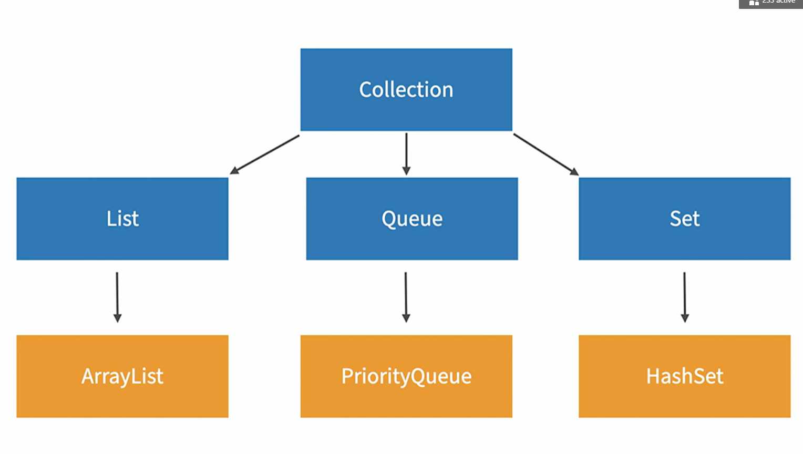

# Java DS Notes

## Choosing a Data Structure

Questions to consider:

- Is the size fixed, or will it changed?
- Are duplicates allowed?
- Is the order important?

We also need to consider the performance of the data structure.

Another thing to think about is memory. Some data structures take up more memory
than others, which also affects performance.

## The Collection Interface

You can iterate through various collections by calling the `forEach()` method on
each class instead of writing for loops.

Key Notes about collections:

- Collections can change in size.
- Collections can't hold primitive types.
    - An array can have a type of int, however, a collections such as a list can't
    - Wrong: `List<int>`
    - Correct: `List<Integer>`
